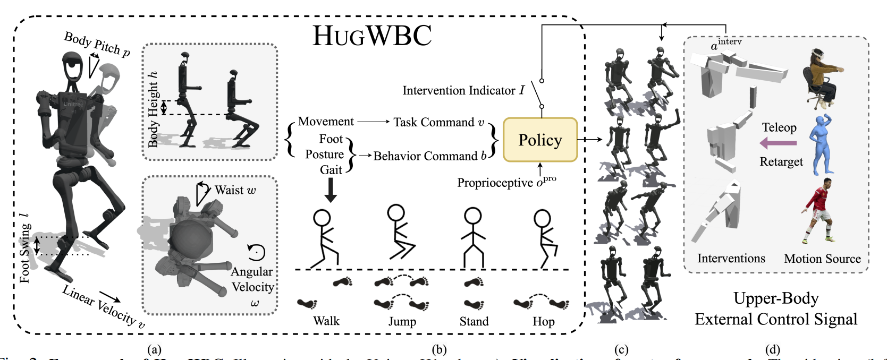
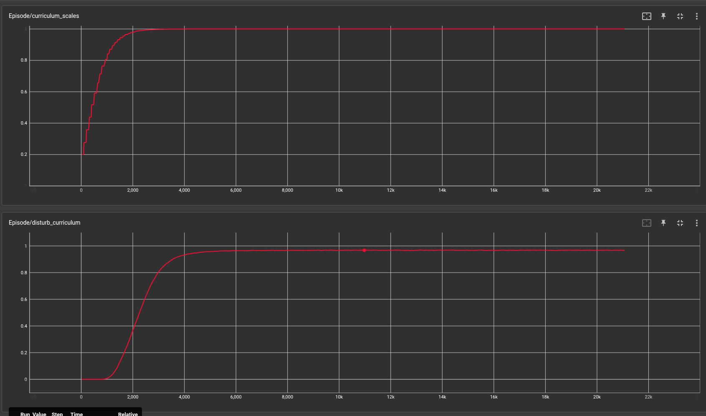
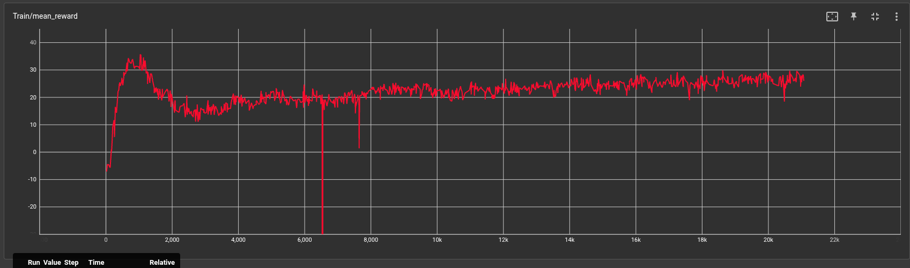
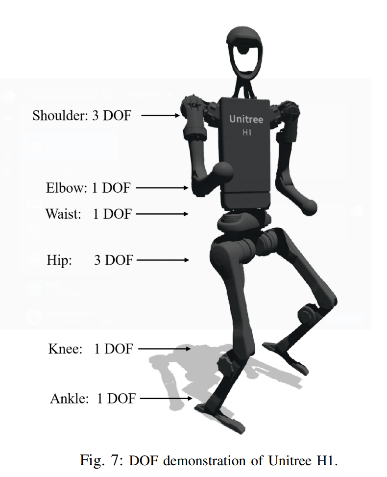
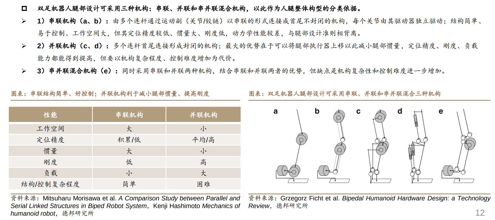
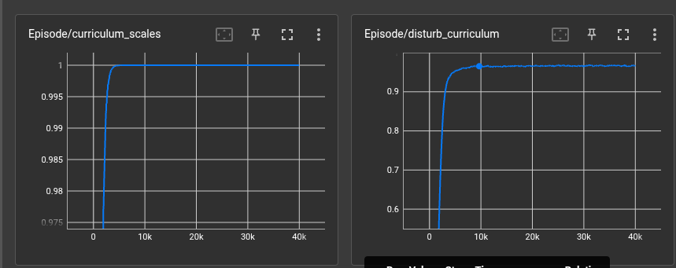
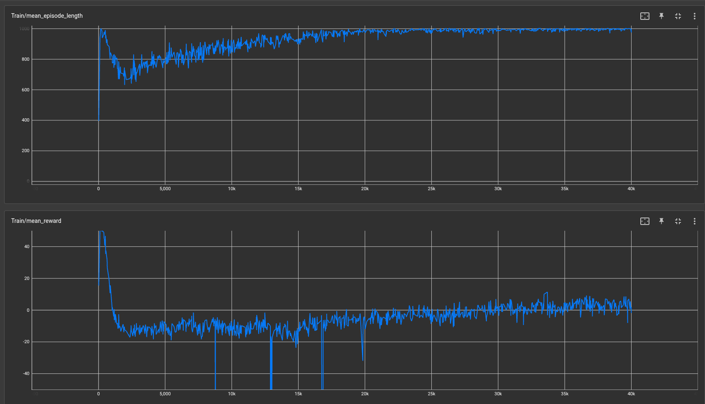

# HugWBC in G1

本文档记录下使用`hugwbc`框架训练29自由度G1人形机器人的思路历程

下贴原项目论文及代码：

> Paper:https://arxiv.org/abs/2502.03206
> Code:https://github.com/apexrl/HugWBC
> url:https://hugwbc.github.io/

## 原项目解读

### 整体架构

hugwbc框架结构如下：

hugwbc是一个通用人形机器人全身控制器，通过强化学习PPO算法和Asyn-ActorCritic网络，并通过引入地形课程学习和噪声课程学习，得到一个上下肢能有效解耦和的全身控制器。

相比于我之前尝试训练过的`unitree_rl_gym`和`humanoid-gym`框架，`hugwbc`让我个人觉得更突出的设计在于：

* 上肢噪声课程学习的应用，使得上下半肢可以有效解耦，实现在上肢作出特定动作甚至故意打乱平衡的动作时，下肢依旧能维持机身的平衡
* 奖励函数的优秀设计，作者为h1设计了精良的奖励函数机制，经过实测h1在很少的训练轮次下就能实现回合长度的迅速增长和reward寻优
* 多步态的融合，作者通过一个policy就能完成walking/jumping/standing任务，也能训出hopping的步态，个人觉得归根结底是课程学习设计的比较好，以及指令空间做得比较细粒度，从而可以通过指令的组合来实现各种步态、姿态的控制

个人实操下来，作者的成果和论文描述吻合，这是篇严谨且精彩的人形通用全身控制器的论文。

### Isaacgym实验

#### 曲线

这里贴几个个人认为比较重要的指标曲线

1. 地形和噪声课程学习的难度曲线

为什么贴这个呢，是因为后续我用`hugwbc`训练G1和神农的时候都出现过地形和噪声课程没有增长的情况，究其原因跟curriculum.threshold的设置和实践训练效果有关

2. h1存活时间的变化曲线

episode_length 和机器人在仿真环境中实际的存活时间是**直接的、线性的正比关系**

episode_length 本身是一个**计数器**

它们之间的换算关系由两个核心参数决定：

1. **物理模拟步长 (sim_dt 或 physics_dt)**: 物理引擎（Isaac Gym）更新一次物理状态所需要的时间。根据代码设置，这个值是 **0.005 秒** (对应 200 Hz 的物理模拟频率)。
2. **降采样/控制频率 (decimation)**: 这个参数定义了“**每进行多少次物理模拟，策略网络（大脑）才做一次决策**”。在h1_config.py 文件中，这个值被设置为 **4**。

==**换算公式**==

这两个参数共同定义了**一个“控制步”**的持续时间：

- **控制步长时间 (Control Timestep)** = sim_dt × decimation
- **实际存活时间 (秒)** = episode_length × **控制步长时间**

所以从直观上看episode_length的变化可以观测到机器人存活状态

这个指标在强化学习框架中很重要，因为有效的强化学习过程势必要让机器人有存活的时间空间来作出探索任务，从而与仿真环境交互获取奖励值并反过来优化策略网络。如果机器人在早期episode_length始终无法得到有效增加甚至下降到个位数级别的话，整个强化学习的初期是无法进行下去的。

3. reward增长曲线

老实讲我还没能太理解reward曲线的深层意义，主要是在我进行reward.scales的调整的时候参考了这个曲线，并且在reward基本呈现上升或稳定时训练收敛性好

如果reward曲线发生波动，并且在可视化界面能看到机器人呈现诡异姿态，基本可以认为是reward_function和其他部分控制代码的关节控制出了问题（如果是调用开源框架的话那多半是索引问题）

#### 效果

在H1上实测跑得效果很好，主要在于下肢的鲁棒性做得比较出色，上肢在噪声控制下整机依旧可以保持平稳站立和运行。后续录个Vlog

### Sim2Sim(还没做)

### Sim2Real（没有h1做不了）

## 迁移到G1机器人上

### 结构对比

#### H1

下面是H1的结构图。H1总计有19个关节自由度，其中:

* 上肢（3+1）x 2 = 8
* 腰间 1
* 下肢 （3+1+1）x 2 = 10

有两点值得关注：

1. H1有一个腰间关节 waist_yaw 或者说 torso_joint，这使得H1可以实现身体转动
2. H1足部只有一个自由度 ankle_pitch

==补充学习：人形机器人腿部设计模式==

#### G1

首先，G1的足部设计与H1呈现较大不同：

G1 踝关节采用并联机构，为用户提供了两种控制模式：

- `PR 模式`：控制踝关节的 Pitch(P) 和 Roll(R) 电机 (默认模式，对应 URDF 模型)

- `AB 模式`：直接控制踝关节的 A 和 B 电机 (需要用户自己计算并联机构运动学)

  硬件上，G1 左脚踝关节采用并联机构，包括四个关节：

  - 并联关节：A 关节、B 关节
  - 串联关节：Pitch 关节 (简称 P 关节)、Roll 关节 (简称 R 关)

其次，G1具有三个自由度的waist关节组成

#### 小结

H1和G1主要区别在于以下几点，在做迁移时要格外关注：

* 腿部关节
* 腰部关节
* 整机质量等相关参数，在进行域随机化的时候可能要进行微调

### HugWBC迁移

#### 代码迁移

浅藏一手

#### Isaacgym实验

发现微调之后训练初期curriculum一直无法正常增长

后来使用了之前训练了4000个epochs的基座模型resume恢复训练，terrain_random_uniform和disturb_curriculum才开始正常增长

训练结果符合我们印象中的各类曲线

值得一提的是，我修改了部分reward_scales后，G1现在可以比较好的运行在上肢噪声运动下，同时下肢保持稳定行走；但是reward的增长状况不佳，有待进一步研究

#### Sim2Sim(准备开展)

#### Sim2Real