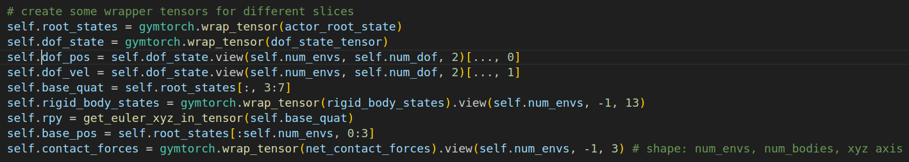
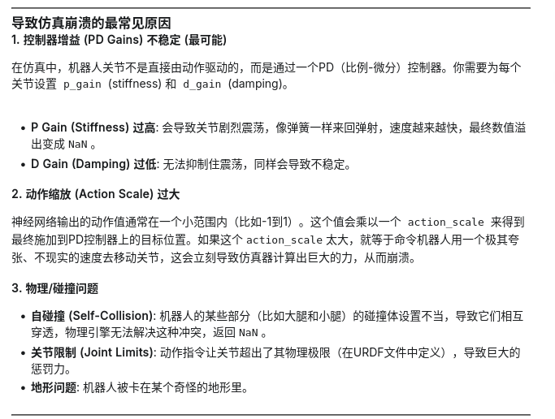

# 人形机器人阶段性实验笔记

8.21-9.8 两周多时间里，我调研并复现了一些经典的人形机器人全身控制器的项目，包括：

* Unitree_rl_gym   宇树科技官方的强化学习gym环境
* Humanoid_gym  
* HugWbc   上交AI Lab 开源的一个人形机器人通用控制器项目

复现原项目本身并没有遇到太多问题，开源代码对于自己项目对应的机器人的相关配置和运行代码已经贴的比较详细。在上面的项目中，我先后训练了宇树的H1、G1机器人，并且也尝试把项目迁移到神农机器人上作进一步的训练和部署。这期间遇到了不少问题，比较坎坷，故写此笔记加以记录。


### 关于同型号机器人但不同关节自由的设置的问题

在实践项目中，我发现Unitree_rl_gym训练g1机器人使用的urdf模型只有12个自由度，细读urdf文件后发现这十二个自由度仅仅包含机器人的下肢，而上肢和腰部关节均固定。

如果想要将上肢加入到强化学习训练中，需要更改urdf文件到29dof版本后，对PD参数、关节力矩、观测值等等各种环境参数和机器人参数作调参和适配。

#### 关节可活动性的设置

在urdf文件中，将原本是`revolute`的关节type改为`fixed`

```urdf
  <joint
    name="left_shoulder_pitch_joint"
    type="revolute">
```

当然更好的方法还是直接寻找对应自由度的urdf文件资源

#### 关节上下肢的训练协调问题

在先后使用`unitree_rl_gym`和`hugwbc`项目中


### 关于强化学习过程中出现的梯度爆炸或消失问题

#### 问题描述

```bash
Traceback (most recent call last):
File "legged_gym/scripts/train.py", line 21, in <module>
train(args)
File "legged_gym/scripts/train.py", line 17, in train
ppo_runner.learn(num_learning_iterations=train_cfg.runner.max_iterations, init_at_random_ep_len=True)
File "/home/ubuntu/Code/Humanoid_Robot/HugWBC/rsl_rl/rsl_rl/runners/on_policy_runner.py", line 135, in learn
metrics = self.alg.update()
File "/home/ubuntu/Code/Humanoid_Robot/HugWBC/rsl_rl/rsl_rl/algorithms/ppo.py", line 141, in update
self.actor_critic.act(obs_batch,
File "/home/ubuntu/Code/Humanoid_Robot/HugWBC/rsl_rl/rsl_rl/modules/actor_critic.py", line 120, in act
self.update_distribution(observations, **kwargs)
File "/home/ubuntu/Code/Humanoid_Robot/HugWBC/rsl_rl/rsl_rl/modules/actor_critic.py", line 115, in update_distribution
self.distribution = Normal(mean, mean*0. + std)
File "/home/ubuntu/anaconda3/envs/hugwbc/lib/python3.8/site-packages/torch/distributions/normal.py", line 57, in init
super().init(batch_shape, validate_args=validate_args)
File "/home/ubuntu/anaconda3/envs/hugwbc/lib/python3.8/site-packages/torch/distributions/distribution.py", line 70, in init
raise ValueError(
ValueError: Expected parameter loc (Tensor of shape (1024, 22)) of distribution Normal(loc: torch.Size([1024, 22]), scale: torch.Size([1024, 22])) to satisfy the constraint Real(), but found invalid values:
tensor([[nan, nan, nan,  ..., nan, nan, nan],
[nan, nan, nan,  ..., nan, nan, nan],
[nan, nan, nan,  ..., nan, nan, nan],
...,
[nan, nan, nan,  ..., nan, nan, nan],
[nan, nan, nan,  ..., nan, nan, nan],
[nan, nan, nan,  ..., nan, nan, nan]], device='cuda:0',
grad_fn=<AddmmBackward0>)
```

可以看到，上面出现的梯度消失非常严重，在整个22D的关节自由度位置指令上，全部为nan

简单来讲就是策略网络输出了无效的NaN作为动作的均值，从而使得机器人无法执行指令，报错

类似的还有：

```bash
ValueError: Expected parameter loc (Tensor of shape (1024, 22)) of distribution Normal(loc: torch.Size([1024, 22]), scale: torch.Size([1024, 22])) to satisfy the constraint Real(), but found invalid values:
tensor([[-4.0550,  0.5222,  3.1268,  ...,  0.6107,  1.5895,  1.3870],
[-3.8628, -0.7063, -2.5858,  ..., -0.4574,  2.2959,  1.7159],
[-2.7815, -0.1935,  1.9052,  ..., -0.5399, -0.1490,  1.1315],
...,
[-3.6575,  0.8438,  0.9931,  ...,  1.9046, -0.4442,  1.4173],
[-0.8177, -0.6383, -3.6764,  ..., -1.0451,  1.2382,  1.1600],
[-5.4800, -0.6892,  1.9030,  ..., -1.3178, -0.7564,  1.5334]],
device='cuda:0')
```

PyTorch的报错机制是这样的：只要张量中**有任何一个元素**不满足约束（比如不是一个有限的实数），它就会报错，并为了方便调试打印出张量的一部分。这一次，它恰好打印出来的那一部分不包含那个“坏掉”的数值，但这并不意味着整个张量都是好的。

#### 问题溯源

在 rsl_rl/modules/actor_critic.py 文件的第115行之前，加入下面的打印语句： 

```python

# --- Start Debug Code ---
if torch.isnan(mean).any():
    print("!!! DETECTED NaN in 'mean' tensor !!!")
if torch.isinf(mean).any():
    print("!!! DETECTED Inf in 'mean' tensor !!!")
# --- End Debug Code ---

self.distribution = Normal(mean, mean*0. + std)
```

可以定性是梯度爆炸还是消失

我遇到的是梯度消失的状况，即出现了NaN，接下来就是去观测NaN出现的位置并且解决问题

```python
    # --- Start Debug Code ---
    if torch.isnan(observations).any():
        print("!!! DETECTED NaN in 'observations' INPUT !!!")
    if torch.isinf(observations).any():
        print("!!! DETECTED Inf in 'observations' INPUT !!!")
    # --- End Debug Code ---
```

经过上述代码打印测试后发现，在输入AC网络前，观测值就出现了NaN，这代表着问题在网络之前就已经出现，最可能的原因是仿真环境传回的观测值出现了问题，也即**仿真崩溃**

随即我调研了出现仿真崩溃的原因，并且开启可视化查看机器人到底出现了什么问题，发现机器人有时会出现局部穿模，脚会深入到仿真器的地板以下位置，这很不寻常；此外机器人还会像被甩出去一样突然起飞，或者向某一个方向栽倒。

基本上可以确定是仿真器的问题。为了最精准地定位到问题所在，我打印了observation输出，发现：

```bash
!!!!!!!!!!!!!!!!!!!!!!!!!!!!!!!!!!!!!!!!!!!!!!!
!!!     NaN DETECTED IN OBSERVATION BUFFER    !!!
!!!!!!!!!!!!!!!!!!!!!!!!!!!!!!!!!!!!!!!!!!!!!!!

--- Analyzing First Problematic Environment: ID 265 ---

    NaN found at Feature Index: 4
    -> This corresponds to:  'Projected Gravity'

--- Full Observation Vector for Env 265 (contains NaN) ---
 ...
[     0.0413,      0.0206,      0.0422,      0.0876,     -0.0604,
-0.9791,     -0.0188,      0.0166,     -0.1324,     -0.0391,
0.1194,     -0.0670,      0.1471,      0.0668,     -0.0976,
0.5150,     -1.3100,     -0.1755,      0.2707,     -0.1895,
0.1697,     -0.0493,      0.0756,     -0.0244,     -0.0131,
0.1644,      0.9413,      0.3888,      0.0386,      0.0686,
0.0400,     -0.0101,     -0.1280,     -0.0726,      0.0077,
-0.0650,     -0.0600,     -0.0166,     -0.0029,      0.0401,
0.0357,      0.0403,      0.0928,     -0.1213,     -0.0192,
-0.0529,     -0.0421,     -0.0000,      0.0239,     -0.0668,
-3.2053,     -1.2962,      0.0489,     -0.0666,    -18.0996,
0.3177,      5.9952,     -3.4055,     -1.7814,      0.1335,
-5.0492,     -3.2970,      0.1117,      7.4009,     -1.5255,
-18.5375,      0.9111,      5.6048,     -4.8758,     -0.5098,
1.2721,      3.1636,      0.0000,      0.0000,      0.0000,
2.2206,      0.5000,      0.5000,      0.0375,     -0.2570,
0.0436,      0.0000,      0.0000,      0.0000],
[        nan,         nan,         nan,         nan,         nan,
nan,         nan,         nan,         nan,         nan,
nan,         nan,         nan,         nan,         nan,
nan,         nan,         nan,         nan,         nan,
nan,         nan,         nan,         nan,         nan,
nan,         nan,         nan,         nan,         nan,
nan,         nan,         nan,         nan,         nan,
nan,         nan,         nan,         nan,         nan,
nan,         nan,         nan,         nan,         nan,
nan,         nan,         nan,         nan,         nan,
-7.0821,     -2.3021,     -1.6330,     -2.6974,    -17.2589,
1.3161,      3.7127,     -3.6670,     -0.4374,      0.9638,
-6.8525,      0.5167,      1.0341,      9.4261,     -1.5518,
-17.3691,     -0.5539,      4.8016,     -5.2627,      0.0293,
3.6016,      2.5687,      0.0000,      0.0000,      0.0000,
2.2206,      0.5000,      0.5000,      0.0375,     -0.2570,
0.0436,      0.0000,      0.0000,      0.0000]], device='cuda:0')
```

显然调试报告显示，ENV265中观测值出现了NaN。更有价值的地方是，我们可以发现nan出现在前50维。根据我的观测空间结构：

* 0-5 ： Base State ( base_ang_vel, projected_gravity)
* 6-27：Dof Pos
* 28-49: Dof Vel
* 50-71: Action
* 72-84: Command & Clock

发现，Action、Command、Clock都有具体数值，但是前50D没有！

让我们回顾项目代码中obs的设计：

```python
    self.obs_buf = torch.cat((
        self.base_ang_vel * self.obs_scales.ang_vel,
        self.projected_gravity,
        (self.dof_pos - self.default_dof_pos) * self.obs_scales.dof_pos,
        self.dof_vel * self.obs_scales.dof_vel,
        self.actions,
        self.commands * self.commands_scale,
        self.clock_inputs, 
    ), dim=-1)
```



再来看这些参量的获取，都是通过gym环境的API获取的实时仿真数据，所以问题彻底定位在了仿真环境上。

那么，怎么解决这个问题？

#### 解决方案的探索

调研人形机器人强化学习中梯度消失现象的成因：（from 	`Gemini 2.5 Pro`）



问题应该是出现在了PD参数上，看样子我需要对PD参数作更加全面的调整

<font color=red>同时由上可知，PD参数不仅会影响机器人本身的关节活动，不合理的PD参数也会给仿真器带来挑战，出现仿真崩溃（也即穿模等不符合物理引擎设计的动作），从而造成学习失败、强化学习终止。要加以防范！</font>

<font color=blue>此外,需要检验是否因为原先代码仓存在dof_name和action没有对齐的问题</font>


## 关于强化学习奖励函数的设计和调参问题

在应用强化学习的过程中,奖励函数的设计非常关键,奖励值的取得一定程度上决定了训练的成效

关于是否存在设计强化学习奖励函数的方法论,我在网上搜索了很多,也带有一些个人的感悟与反复尝试,特记录于此.

### 应对稀疏奖励:课程学习

在训练初期,机器人无法有效响应指令动作,基本上除了惩罚项很难取得正向奖励.想要取得不错的学习效果,一步步的课程学习的设计经验值得被学习.

```python
class RewardThresholdCurriculum(Curriculum): # 基于奖励阈值的课程学习类
    def __init__(self, seed, **kwargs):
        super().__init__(seed, **kwargs)
 
        self.episode_reward_lin = np.zeros(len(self))  # 线性奖励统计
        self.episode_reward_ang = np.zeros(len(self))  # 角向奖励统计
        self.episode_lin_vel_raw = np.zeros(len(self)) # 原始线速度统计
        self.episode_ang_vel_raw = np.zeros(len(self)) # 原始角速度统计
        self.episode_duration = np.zeros(len(self))    # 回合持续时间统计

    def get_local_bins(self, bin_inds, ranges=0.1): #获取邻接
        if isinstance(ranges, float):
            ranges = np.ones(self.grid.shape[0]) * ranges
        bin_inds = bin_inds.reshape(-1)

        adjacent_inds = np.logical_and(
            self.grid[:, None, :].repeat(bin_inds.shape[0], axis=1) >= self.grid[:, bin_inds, None] - ranges.reshape(-1, 1, 1),
            self.grid[:, None, :].repeat(bin_inds.shape[0], axis=1) <= self.grid[:, bin_inds, None] + ranges.reshape(-1, 1, 1)
        ).all(axis=0)

        return adjacent_inds

    def update(self, bin_inds, task_rewards, success_thresholds, local_range=0.5, weights_up=0.2):

        is_success = 1.
        for task_reward, success_threshold in zip(task_rewards, success_thresholds):
            is_success = is_success * (task_reward > success_threshold).cpu()
        if len(success_thresholds) == 0:
            is_success = np.array([False] * len(bin_inds))
        else:
            is_success = np.array(is_success.bool())

        # if len(is_success) > 0 and is_success.any():
        #     print("successes")

        self.weights[bin_inds[is_success]] = np.clip(self.weights[bin_inds[is_success]] + weights_up, 0, 1)
        adjacents = self.get_local_bins(bin_inds[is_success], ranges=local_range)
        for adjacent in adjacents:
            #print(adjacent)
            #print(self.grid[:, adjacent])
            adjacent_inds = np.array(adjacent.nonzero()[0])
            self.weights[adjacent_inds] = np.clip(self.weights[adjacent_inds] + weights_up, 0, 1)

    def log(self, bin_inds, lin_vel_raw=None, ang_vel_raw=None, episode_duration=None):
        self.episode_lin_vel_raw[bin_inds] = lin_vel_raw.cpu().numpy()
        self.episode_ang_vel_raw[bin_inds] = ang_vel_raw.cpu().numpy()
        self.episode_duration[bin_inds] = episode_duration.cpu().numpy()

```

此外,除了奖励函数,针对地形和噪声,hugwbc也设计了课程学习

### 强化学习奖励值Scales

在训练过程中我尝试性的调整了很多次奖励函数,有新增足部放平的约束项,也有增加存活奖励和指令跟踪奖励的权重

```python
class scales( LeggedRobotCfg.rewards.scales ):
            tracking_lin_vel = 3.0 # 2.0 -- 3.0
            tracking_ang_vel = 3.6 # 3.0 -- 3.6
            dof_pos_limits = -10.0
            lin_vel_z = -0.1
            ang_vel_xy = -0.5 # -0.5 - -0.3
            hip_deviation = -2 
            shoulder_deviation = -1
            hip_yaw_deviation = -0
            hip_roll_deviation = -0
            shoulder_yaw_deviation = -0
            shoulder_roll_deviation = -0
            shoulder_pitch_deviation = -0
            elbow_deviation = -0
            # feet_deviation = -1
            feet_flatness = -5
            joint_power_distribution = -0.5
            no_fly = 0.5 # 0.25 -> 0.5
            termination = -200 # -200 -- -500

            dof_vel_limits = -2
            action_rate = -0.01
            feet_contact_forces = -0.2  
            feet_slip = -0.2
            feet_stumble = -0.2
            dof_acc = -2.5e-7 
            torques = -5e-6
            orientation_control = -20.0
            waist_control = -2.0
            base_height = -40
            collision = -0.0
            stand_still = -10
            tracking_contacts_shaped_force = 2
            tracking_contacts_shaped_vel = 4
            feet_clearance_cmd_linear = -30 
            feet_clearance_cmd_polynomial = -0
            hopping_symmetry = -5
            standing = 1.0
            standing_air = -1.0
            standing_joint_deviation = -2.0
            alive = 0.6
```


## 关于镜像对称损失在人形强化训练中的作用

### 设计消融实验

| H1               |      |      |
| ---------------- | ---- | ---- |
| H1 + symmetry    |      |      |
| H1int            |      |      |
| H1int + symmetry |      |      |
| S2               |      |      |
| S2 + symmetry    |      |      |
| S2int            |      |      |
| S2int + symmetry |      |      |
|                  |      |      |

这两天可以重溯整套代码,梳理逻辑,然后在G1 29dof的机器人上尝试部署试试效果如何


## Sim2Sim

学习sim2sim的技术和知识

